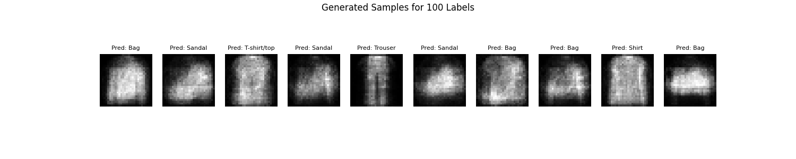
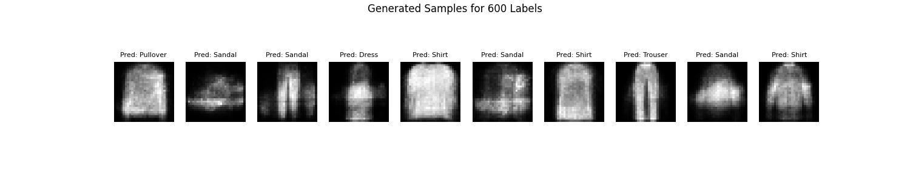
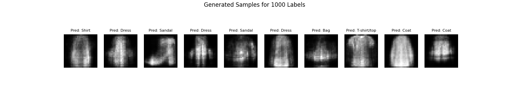
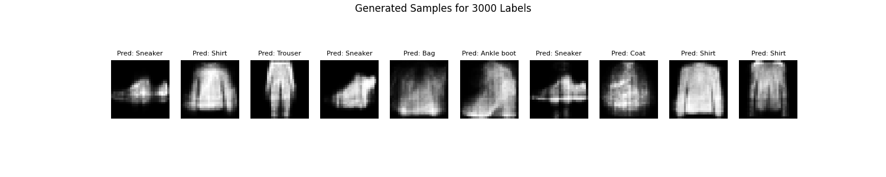

# Semi-Supervised Learning with Variational Autoencoders

## GitHub Repository
All code and results can be found at the GitHub repository: [Deep Learning HWs](https://github.com/devleibowitz/DeepLearningHWs.git).

## Introduction
This repository presents an implementation of the **M1 model** from *Semi-Supervised Learning with Deep Generative Models* by Kingma et al., applied to the Fashion MNIST dataset. The approach integrates a **Variational Autoencoder (VAE)** for feature extraction and a **Support Vector Machine (SVM)** for classification.

For this implementation, we used a Radial Basis Function (**RBF**) kernel, which is a Gaussian kernel, for the SVM.

## Model Overview
The implemented model consists of:
- A **Variational Autoencoder (VAE)** that learns a latent representation of the dataset.
- A **Support Vector Machine (SVM)** that utilizes these learned features to classify Fashion MNIST images.

## Training Procedure
To train the model, execute all sections in `problem3_semisupervised.ipynb`.

**Note:** Running this script will overwrite any pre-existing saved models.

## Running Pretrained Models
To use the saved models instead of training from scratch, follow these steps:

1. Ensure all dependencies are installed using Poetry:
   ```sh
   poetry install
   ```

2. Activate the Poetry environment:
   ```sh
   poetry shell
   ```

3. Run the notebook `problem3_semisupervised.ipynb`, skipping training and directly using the saved models from the `models/` directory:
   - `vae_model_100.pth`, `vae_model_600.pth`, `vae_model_1000.pth`, `vae_model_3000.pth`
   - `svm_model_100.joblib`, `svm_model_600.joblib`, `svm_model_1000.joblib`, `svm_model_3000.joblib`

## Evaluation
If trained models are unavailable, first execute **Section 4** to train them. To evaluate the trained model and visualize generated samples with their predicted labels, run **Section 5** of the notebook.

## Results
The table below summarizes the classification accuracy of the model for different numbers of labeled dataset samples.

| Number of Labels | Accuracy (%) |
|-----------------|-------------|
| 100            | 80.21       |
| 600            | 84.09       |
| 1000           | 84.89       |
| 3000           | 86.37       |

### Sample Outputs
Below are sample outputs for different labeled dataset sizes:

**100 Labels:**  


**600 Labels:**  


**1000 Labels:**  


**3000 Labels:**  


## Comparison with Existing Work
Since Kingma et al. evaluated their method on digit-MNIST, we compare our results with other works on Fashion MNIST to ensure competitive performance.

| Method | Accuracy (%) |
|-----------------|-------------|
| Semi-Supervised Learning (Ours) | 86.4 |
| CatGAN - Springenberg | 83.60 |
| Improved GAN - Salimans et al. | 88.50 |
| Triple GAN - Li et al. | 89.55 |

## References
- Kingma, D. P., Rezende, D. J., Mohamed, S., & Welling, M. (2014). *Semi-supervised Learning with Deep Generative Models*. [arXiv:1406.5298](https://arxiv.org/abs/1406.5298).
- Springenberg, J. T. (2016). *Unsupervised and Semi-supervised Learning with Categorical Generative Adversarial Networks*. [arXiv:1511.06390](https://arxiv.org/abs/1511.06390).
- Li, C., & Zhang, M. (2017). *Triple Generative Adversarial Nets*. [arXiv:1703.02291](https://arxiv.org/abs/1703.02291).
- Salimans, T., Goodfellow, I., Zaremba, W., Cheung, V., Radford, A., & Chen, X. (2016). *Improved Techniques for Training GANs*. [arXiv:1606.03498](https://arxiv.org/abs/1606.03498).

